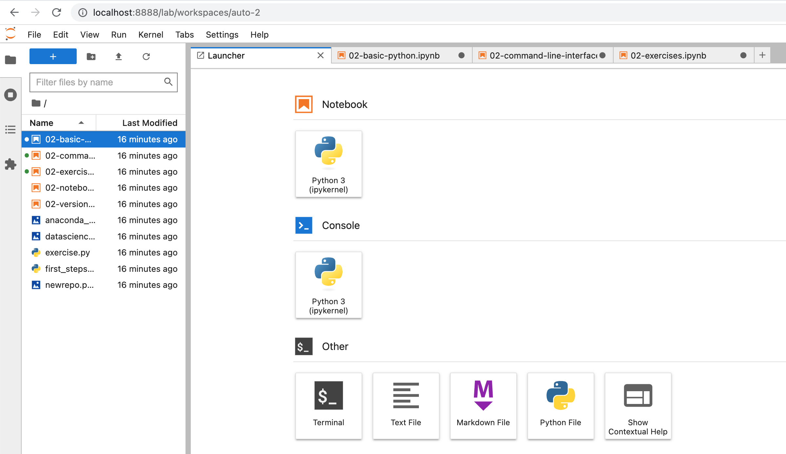

# Homework 0
**Applied Data Visualization.**  
*This homework is due before class on Wednesday, August 21rd.*  


Welcome to Applied Data Visualziation. In this class, we will be using a variety of tools that will require some initial configuration. To ensure everything goes smoothly moving forward, we will set up the majority of those tools in this homework. This homework will not be graded, but **it is essential that you complete it before the second lecture** as it sets up the tools that we will be using in class for exercises.

## 1. Python Setup

We'll often work on practical skills related to data visualization. That means we'll write code, and we'll do that in a programming language called Python.

Python has three advantages for this class: it's pretty easy to learn, it's the language of choice for many data scientists, and it can be used inside of Jupyter Notebooks – more on the latter will follow later.

We also assume that you know the basics of how to work with a terminal / console. If you don't, check out an introduction like [this](http://tutorial.djangogirls.org/en/intro_to_command_line/).  

First, we'll need to install some things:

### 1.1 Installing Python

Chances are, if you're on a mac, you already have Python installed. You can simply try to run python from a console by running

```
$ python
```

However, as most software, Python comes in different versions and is packaged differently depending on your needs. In this class we'll use a Python distribution called Anaconda. Anaconda comes with a lot of packages that we'll need, so it is the most hassle-free option for us.

Go to [this website](https://www.anaconda.com/download/) and install anaconda for Python 3.11 for your operating system. [Here](https://docs.continuum.io/anaconda/install) are installation instructions if you need them. If you already have anaconda installed, please make sure that you're using the latest version or [update](http://docs.continuum.io/anaconda/install/update-version/) if necessary. For example on a Mac anaconda can be updated to the most recent version by entering the following commands in the command line:

```
$ conda update conda
```

You'll have to create a new environment for Python 3.12 if you're not using that already. If you did a fresh install, this won't be necessary. Here is the update command:

```
$ conda install python=3.12
```

Once you've installed Anaconda, close your terminal window and re-open it – otherwise your terminal won't recognize the Anaconda commands.

Anaconda is both, a package manager and an environment manager. A package manager manages, well, packages. Packages add specific pieces of functionality - there are packages for web scraping, or for data visualization, for example. An environment manager, in contrast, allows you to have different versions of packages installed at the same time. We'll dive into environments and packages when we need them at a later point.

Let's see whether Anaconda works as intended. Run:

```
$ conda --version
```

from your terminal. You should see something like this as a result:

```
$ conda --version
conda 24.7.1
```

Similarly, for python, you should see something like this:

```
$ python --version
Python 3.12.4
```

Note that all of these commands can be done through the Anaconda Navigator itself. To do so, go to the "Environments" tab on the left-hand side of Anaconda Navigator. From there, you can search for python (or any of the other packages installed) and the version will be clearly indicated.

You can also check out the [official website](http://conda.pydata.org/docs/test-drive.html) for more details on anaconda, environments, and packages.

## 2. Installing Jupyter

***Check out the official Jupyter documentation [here](http://jupyter.readthedocs.io/en/latest/index.html) for all the details***

We'll be running Python through Jupyter Labs as they are great for the data science process and for teaching, but you should be aware of the other options we discuss here.

Notebooks are stored in files that end with a `.ipynb` extension. They are included in the [basic-python](./basic-python/) folder in this directory. Download them and save them to a folder.

Notebooks make use of an improved, interactive client for python called [IPython](https://ipython.org/). IPython might already be installed in the latest version if you did a clean anaconda install. To check, we'll use anaconda to install the proper version of IPython. Run:

```
$ conda install ipython
```

and confirm that in fact ipython 7.31.* is installed.
```
$ ipython --version
8.25.0
```

Now, change directories in your console so that you're in the directory where the notebook file is saved and run:

```
$ jupyter-lab
```

This will start the notebook server and should open up a browser window point to [http://localhost:8888/](http://localhost:8888/) that will look like that:



Click on the `02-notebooks.ipynb` entry to see if it works. 

This is now a complete coding environment. However, we want to make use of the latest fancy AI technology, namely Large Language Models, so we need to take a few additional steps. 

Note that if you prefer, you can just use Jupyter Labs with a web-based LLM such as ChatGPT.

## 3. Installing Visual Studio Code

If you like, you can work directly in Jupyter Labs. However, we recommend that you set up Visual Studio Code to edit your notebooks. The main benefit is that you get auto-complete for function calls, and this includes LLM backed auto-complete through github co-pilot. 

You can get VS Code here: https://code.visualstudio.com/

## 4. Setting up CoPilot

CoPilot is a large language model (LLM) like ChatGPT that is trained on code. We will use both ChatGPT and CoPilot; they have their respective pros and cons. To set up co-pilot, you will need to (a) get a github educational license, and (b) add a few extensions. 

To get the education account, visit https://education.github.com/
Note that this might take a bit to be verified, and you might have to upload a student ID. 

Then you should be able to access co-pilot. Here is an [introductory video for using co-pilot in jupyter](https://www.youtube.com/watch?v=QS_bh-3qKdw)

And these are the extensions you'll need for working with copilot in jupyter. 
* [The Python extension](https://marketplace.visualstudio.com/items?itemName=ms-python.python)
* [Codepaces](https://marketplace.visualstudio.com/items?itemName=GitHub.codespaces)
* [Copilot](https://marketplace.visualstudio.com/items?itemName=GitHub.copilot)
* [Jupyter](https://marketplace.visualstudio.com/items?itemName=ms-toolsai.jupyter) 


You can check out copilot key bindings [here](https://docs.github.com/en/copilot/managing-copilot/configure-personal-settings/configuring-github-copilot-in-your-environment). Note that they sometimes conflict with Jupyter commands.


### 4. Self Study: Python

We recommend that you go through [Google's Python Tutorial](https://developers.google.com/edu/python), sections Intro, Strings, Lists, Sorting, Dicts and Files. 
